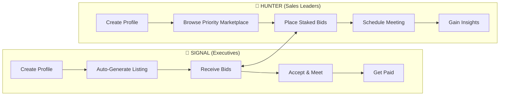
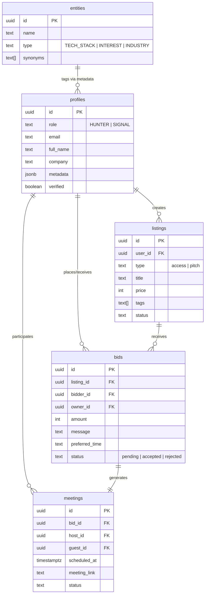

# Signal v2 Platform Roadmap

> **Last Updated:** December 29, 2025  
> **Status:** Phase 1 ~90% Complete  
> **Repository:** [github.com/markrd/Signal-](https://github.com/markrd/Signal-)

---

## Version History

| Version | Date | Changes |
|---------|------|----------|
| 1.1.0 | Dec 29, 2025 | LinkedIn OIDC OAuth integration complete. Verified profiles now supported. |
| 1.0.0 | Dec 29, 2025 | Initial GitHub push. Removed 91KB legacy code. Established as single source of truth. |

---

## Vision

**Signal** is a decentralized B2B marketplace connecting **Executives** (SIGNAL) with **Sales Leaders** (HUNTER). Executives monetize their seniority and strategic insights through paid meetings, while Sales Leaders gain direct access to qualified decision-makers.



---

## Current State (December 29, 2025)

| Component | Status | Notes |
|-----------|--------|-------|
| **Homepage** | ✅ Complete | Landing page with CTAs |
| **Auth System** | ✅ Complete | Supabase Auth integration |
| **Conversational Onboarding** | 🟡 Evolving | Migrated to Hybrid Wizard model |
| **Hybrid Onboarding Wizard** | ✅ Complete | AI + Structured 8-step flow |
| **Seniority Pricing** | ✅ Complete | Dynamic rate suggestions |
| **Listing Creation** | ✅ Complete | Auto-generated from onboarding |
| **Bidding System** | ✅ Complete | Full modal flow with AI invitations |
| **Bid Management** | ✅ Complete | Accept/reject with meeting generation |
| **Exec Dashboard** | ✅ Complete | Offers, Diary, Profile tabs |
| **Priority Marketplace** | ✅ Complete | Luxury "Shop Window" design |
| **Modal UX** | ✅ Complete | Top-middle positioning, spring animations |
| **Meeting Scheduling** | ❌ Missing | No calendar integration |
| **Payments** | ❌ Missing | No Stripe integration |
| **Notifications** | ❌ Missing | No email/push notifications |

---

## Database Schema



---

## Phase 1: Core Marketplace Loop (MVP) — ~90% Complete

**Goal:** Enable the basic transaction flow — Executives list availability, Hunters bid, meetings happen.

### 1.1 Executive Listing Flow ✅ COMPLETE
- [x] **Create Listing Page** — Form for executives to create availability slots
- [x] **Listing Card Component** — Display listing with price, tags, availability
- [x] **My Listings Dashboard** — View/edit/delete own listings
- [x] **Auto-generate listing** from onboarding data (title, price, tags)

### 1.2 Hunter Discovery & Bidding ✅ COMPLETE
- [x] **Priority Marketplace** — Redesigned list layout for high-density signal
- [x] **Anonymous Discovery** — Hidden executive names and anonymized company categories
- [x] **AI Signal Insights** — Mocked intent and budget signal for demonstration
- [x] **Enhanced Marketplace Feed** — Filtering, search, sorting
- [x] **Listing Detail Modal** — Full "Executive Dossier" with rich metadata
- [x] **Place Bid Modal** — Double confirmation, AI-assisted invitations
- [x] **Escrow Protection Communication** — Clear trust indicators
- [x] **My Bids Dashboard** — Track sent bids and statuses
- [x] **Privacy Hardening** — Removal of PII from pre-acceptance flow
- [x] **UX Polish** — Top-middle modal positioning, spring animations
- [x] **Luxury "Shop Window" Design** — Gold accents, verified badges

### 1.3 Bid Management ✅ MOSTLY COMPLETE
- [x] **Incoming Bids View** (Executive) — Review and respond to bids
- [x] **Accept/Reject Actions** — Status updates with notifications
- [x] **Meeting Generation** — Automatic meeting creation on bid acceptance
- [ ] **Counter-offer Flow** — Negotiate bid amounts

### 1.4 Basic Notifications ❌ NOT STARTED
- [ ] **In-app Notification Center** — Bell icon with unread count
- [ ] **Email Notifications** — Supabase Edge Functions for triggers

### 1.5 Onboarding UX ✅ COMPLETE
- [x] **Hybrid Onboarding Wizard** — Implemented 8-step structured flow with AI enrichment
- [x] **Progressive Profiling** — One-question-at-a-time navigation
- [x] **LocalStorage Persistence** — Save/resume progress for 24h
- [x] **Role-Based Branching** — Specific paths for SIGNAL and HUNTER
- [x] **Progress Bar** — Animated gradient tracking
- [x] **Light Mode Background** — White theme for better visibility
- [x] **Back to Home Navigation** — Exit onboarding anytime

---

## Phase 2: Meeting & Payment Infrastructure — 0% Complete

**Goal:** Enable end-to-end transactions with scheduling and payments.

### 2.1 Meeting Scheduling
- [ ] **Calendar Integration** — Calendly or custom availability picker
- [ ] **Meeting Confirmation Flow** — Link generation after bid acceptance
- [ ] **Meeting Reminders** — Email reminders 24h and 1h before

### 2.2 Payments (Stripe Connect)
- [ ] **Stripe Onboarding** — Executives connect Stripe accounts
- [ ] **Payment Capture** — Hold funds when bid accepted
- [ ] **Payout on Completion** — Release to executive post-meeting
- [ ] **Refund Handling** — Cancellation policies

### 2.3 Trust & Verification
- [x] **LinkedIn OAuth** — One-click "Continue with LinkedIn" for verified identity ✅
- [ ] **Verified Badge** — Display on profiles and listings
- [ ] **Review System** — Post-meeting ratings (both sides)

---

## Phase 3: Intelligence & Matching — 0% Complete

**Goal:** Use AI to improve discovery and match quality.

### 3.1 Smart Matching
- [ ] **Recommendation Engine** — Surface relevant listings to Hunters
- [ ] **Hunter Intent Analysis** — Extract target criteria from onboarding
- [ ] **Real Match Score** — Actual compatibility calculation (not mocked)

### 3.2 Knowledge Graph Expansion
- [ ] **Entity Relationship Mapping** — Connect tech stacks to industries
- [ ] **Trend Analysis** — Surface hot topics and emerging areas
- [ ] **Auto-tagging** — AI-generated tags for listings

### 3.3 Search & Discovery
- [ ] **Full-text Search** — Postgres FTS or Algolia
- [ ] **Advanced Filters** — Industry, tech stack, seniority, price range
- [ ] **Saved Searches** — Hunters save and get notified

---

## Phase 4: Growth & Scale — 0% Complete

**Goal:** Drive adoption and optimize for network effects.

### 4.1 Invite System
- [ ] **Referral Codes** — Track invite chains
- [ ] **Incentives** — Credits for successful referrals
- [ ] **Waitlist Management** — Control growth pace

### 4.2 Analytics Dashboard
- [ ] **Executive Analytics** — Earnings, meeting stats, profile views
- [ ] **Hunter Analytics** — Response rates, meeting ROI
- [ ] **Admin Dashboard** — Platform-wide metrics

### 4.3 Mobile Experience
- [ ] **Responsive Design Audit** — Full mobile optimization
- [ ] **PWA Configuration** — Installable web app
- [ ] **Push Notifications** — Browser push for key events

### 4.4 Advanced Features
- [ ] **Group Meetings** — Panel sessions with multiple executives
- [ ] **Subscription Tiers** — Monthly access packages
- [ ] **API Access** — For enterprise integrations

---

## Technical Stack

| Layer | Technology |
|-------|------------|
| **Frontend** | React + TypeScript + Vite |
| **Styling** | Tailwind CSS |
| **Backend** | Supabase (Postgres + Auth + Edge Functions) |
| **AI/LLM** | OpenAI GPT-4 (onboarding extraction) |
| **Payments** | Stripe Connect (planned) |
| **Hosting** | Google Cloud Run (current), Vercel (planned) |
| **MCP** | Supabase MCP for DB management |

---

## Key Metrics (North Stars)

| Metric | Phase 1 Target | Phase 2 Target |
|--------|----------------|----------------|
| **Active Executives** | 50 | 200 |
| **Active Hunters** | 100 | 500 |
| **Meetings/Month** | 20 | 200 |
| **GMV/Month** | $5,000 | $50,000 |
| **Avg Meeting Price** | $250 | $300 |

---

## 🎯 Immediate Next Steps (Priority Order)

| # | Feature | Priority | Est. Effort |
|---|---------|----------|-------------|
| 1 | **In-app Notification Center** | 🔴 High | 2-3 days |
| 2 | **Email Notifications** | 🔴 High | 2-3 days |
| 3 | **Meeting Scheduling** | 🔴 High | 3-5 days |
| 4 | **Stripe Onboarding** | 🔴 Critical | 3-5 days |
| 5 | **Counter-offer Flow** | 🟡 Medium | 1-2 days |
| 6 | **Mobile Responsive Audit** | 🟡 Medium | 2-3 days |

---

## Open Questions

> [!IMPORTANT]
> These decisions will shape the platform direction:

1. ~~**Payment Model**~~ — ✅ **DECIDED:** Hold & Release escrow (funds captured on bid acceptance, released on meeting completion)
2. **Meeting Format** — Video call only, or also in-person?
3. **Pricing Control** — Let market set prices, or enforce ranges?
4. ~~**Verification Method**~~ — ✅ **DECIDED:** LinkedIn OAuth for verified identity
5. **Mobile Priority** — PWA first, or native apps later?

---

## Architecture Decision Records (ADRs)

### ADR-001: Payment Model — Hold & Release Escrow
**Date:** December 2025  
**Status:** Accepted  
**Decision:** Funds are captured when a bid is accepted and held in escrow. Released to the executive automatically 48h after meeting completion, or immediately upon Hunter verification.

### ADR-002: Identity Verification — LinkedIn OAuth
**Date:** December 2025  
**Status:** Accepted  
**Decision:** Use LinkedIn OAuth for one-click identity verification instead of LLM-based profile scraping. Provides verified company/title data and displays verified badge.

### ADR-003: Onboarding — Hybrid Wizard Model
**Date:** December 2025  
**Status:** Accepted  
**Decision:** Replaced pure conversational LLM onboarding with an 8-step structured wizard that uses AI for enrichment. Better UX, more predictable, LocalStorage persistence for 24h.

---

## Contributing

This roadmap is a living document. Update as features are completed and priorities shift.

```bash
# Mark a feature complete
- [x] Feature name — Description

# Mark in progress  
- [/] Feature name — Description
```
